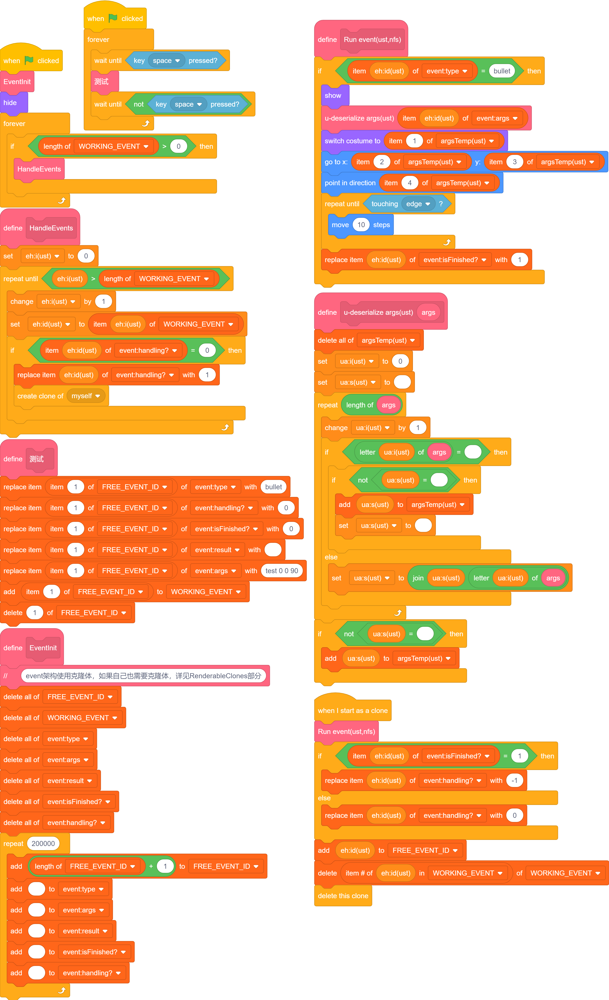
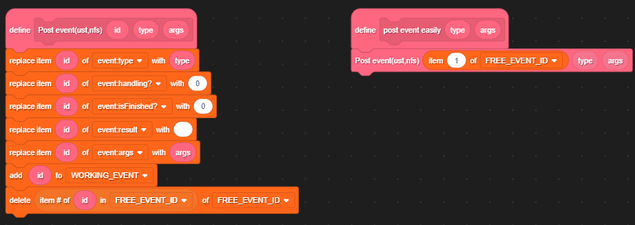
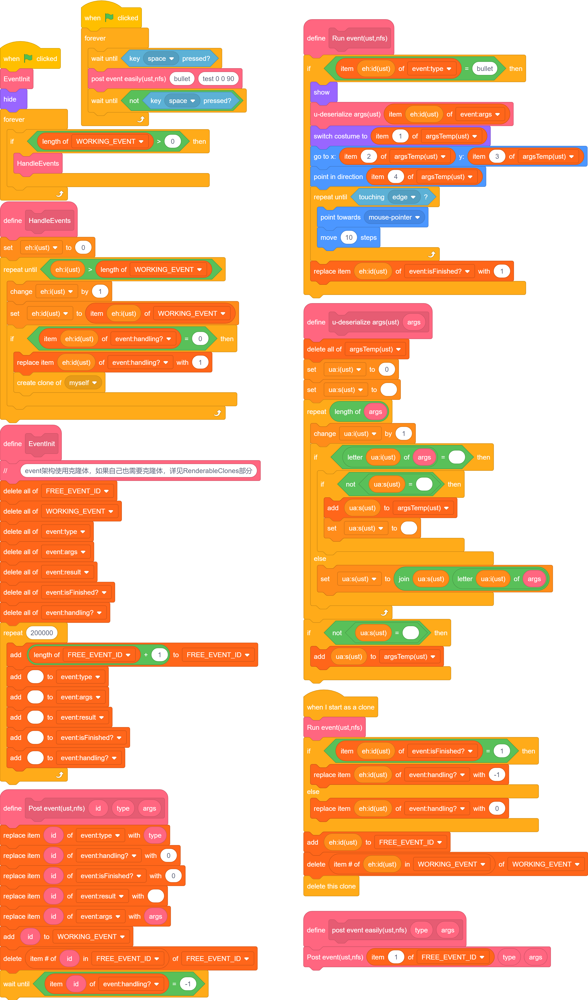

# Events

话接上文 ~~好像不是上文，反正差不多~~，我们实现了 `command` 表，能够向新线程单独传参了。  
我们的目的是创建类似“函数对象”的东西，同时能做到“二次修改”。（后面将提到它的作用。）

总之，如果你学过 `Java` 的 `Event`，那这部分应该很好理解。（大概吧。）

## 实现等待线程的终止

### command->event

之前使用变量传递参数，这使得我们无法再获取新建克隆体信息的更新，也就阻止了我们进一步开发。  
所以我们应使用 列表。

将之前传递许多参数改为传递多个列表，一般分为 `type`、`args`，为了标注event对外信息，新建`result`、`isFinshed?`、`handling?`。

写成 `command` 太长，我不演了。直接上 `Event`。（这部分与先前没有功能上的差异，只是增减了列表并修改了名称。）

  
[点此测试](./test1.html)

总的来说，我们确实没实现啥，接下来我们会对子弹发射进行限制并增强：子弹会面朝鼠标进行转动修正、上一发子弹撞墙后才允许下一发。  

### 等待的到来

我们已经有了 `isFinished`，只要记录它就好了，我们这里为了使参数更加稳定，进行了一次封装。

这样，我们发布Event时就不用指定id了（图左），而是按照既定方案寻址（图右）。
之后，经过简单的修改，我们实现了 `等待`。

本来想放图的，但是太占地方了。

### 追踪！

由于暂时不用URM，而且目前几乎没有交互部分，所以可以随便写。
比上一步就多了一个模块，就一块放图了。

甚至不到150模块。  
[点此测试](./test2.html)

## 实现返回值

Event架构本身难以实现即时更新类的功能，例如碰撞造成伤害及相关内容。但是对于有序的不限时行为，能有更好的处理。

## ...

## 扩展

这部分是我从使用这个架构一年多直到现在汇总出的一些好用的内容。
我会加上大致时间。

### 无返回值Event

在最原始的 `Event` 架构中，我们没有使用 `scratch` 的多线程（虽然我知道它是假的）。  
但众所周知，`scratch` 每帧执行的次数有限，往一帧里多塞一些内容总会加快它的效率的。

### ...

...

### 多端Event

当你使用多角色...

### 页面Event

专门作为 `Manipulator` 使用...

一般没有对应的 `Listeners`/`Triggers`，也可看作可复用的、有局部变量、每次只对一个新克隆体操作的广播模块来使用。

通常搭配 `setRender` 等封装函数，直接或间接与 `channels`、`R`、`U` 等交互，实现根据输入操作页面、跳转页面（主用于切换 `U`、`R` 的状态）。

页面之间的切换使用此法可尽可能避免未定义的页面切换，保证程序在不同页面之间不受到干扰。

具体来说，切换页面时发送有 `result` 的 `event`，使得原 `页面event` 的运行暂停，而新的 `页面event` 则开始运行，执行切换页面及新页面相关指令。

### 子类标记参数

在常见参数后，可以添加不定数量的子类标记参数。（注意，这部分可能不保证合法性，可能有潜在的bug，需要更多定义去保证合法）  
举例：假定`OnDamageTo`事件的参数有3个，为`toEnemy?`、`toPos`和`amount`，只跟收到伤害方有关。  
这个事件的创建是合理的，因为伤害可以是无来源的。如果我们要关联来源，可以单加一个事件，但与 `EventTriggers` 和 `EventListeners` 等共用时会稍显冗余。  

此时，我们可以在参数后面添加 `子类标记参数`。  
假定我们将来源称作 `fromE`，对于 `OnDamageTo(true,1,5)`，我们改为 `OnDamageTo(true,1,5,fromE(false, 0))`。  
在sc中，写作`1 1 5 :fromE 0 3`，我们一般将布尔类型写作数值。

我们正常情况下不会处理后面的值，而前缀符 `:fromE` 则可以帮助我们定位参数。  
一般索引时，查找第一个 `:[identifier](空格)` 或 `(空格):[identifier](空格)` ，这可以避免一些问题。

### EventListeners/分类器
作用：直接根据指定对象，或提取泛化后类型，执行相关功能。  
有两种用途。  

一种是对已有的 `Events` 进行结果再处理（更常使用 `EventTriggers`）；  
一种是在某处特别发送一个特殊的 `Events`，其处理结果的过程仅仅为赋值一个变量、简单运算或者空。 

我举个例子：  
`A` 攻击 `B`，发送 `OnDamageTo('B', 5, Type.ICE, fromE('A'))`，由 `AttackersEvents` 接受到 `fromE()`。  
`AttackersEvents` 找到对应于 `Global.getType('A')` 的 `Listener`，触发相关的攻击效果。  
可能会触发若干以下几种效果：  
执行正常攻击，（假设存在血量、护甲、伤害减免）计算减免后优先扣除护甲再扣除血量；  
执行破甲攻击，直接破除所有护甲并计算减免，再直接扣除血量；
攻击后释放持续冻结效果。

看起来毫无章法的运作，在掌握 `event` 之后，便能成为你的武器，在不同的情形下都得到良好的实现，优雅地实现他人无法做到的功能。

那么，回到两种用途上。

对于第一种用途，一类是无来源的、一类是有来源的。

对于有来源的情形，一般存在一个中间函数注册于 `event` 中，用于存储该 `Listener`（与 `Triggers` 有相近之处）。  
中间函数会拆分这些标记的状态，去除不正确（未定义）的函数，并留有位置用于注册以对应不同的 `Listener`。

对于无来源的情形，少数是直接基于原始 `event` 的返回值、参数等进一步加工结果并执行相关内容。  
而多数情形则是从有来源的情形下拆分相对共有的功能，或一部分 `Listener` 共有的代码行，来集中处理，并提高可读性。

...

### Event换头以及Event归类
作用：对于已有对象，强制类型转换（无对象、其他Event或其他类型的对象）。
用途：明确不同 `event` 的用途，同时尽可能复用之前的代码。

换头的行为有三种，一种是仅换名，一种是换名换参，一种是换实现。
前两种与原始的 `event` 是相同的，可以认为存在一些默认值。

对于第三种，可以破除 `Listeners` 的界域限制，同时提高原有部分的可读性（减少特殊情况分类），并提供合法的参数。

一般换头是基于全局或者某一类 `Listeners`。

...

### EventTriggers/触发器
作用：将无指定对象的 `Events` 指定对象。

看起来触发、监听是相似的行为，然而实际上无论是内部还是外部的体现上，均有巨大的差异。

我举个例子：  
`A` 攻击 `B`，发送 `OnDamageTo('B', 5, Type.ICE, fromE('A'))`，……，触发相关的攻击效果。
假如正常攻击。
此时旁边的一个实体也有特殊能力，但是与当前攻击行为完全无关，如何将这二者建立关联呢？

这就用到了 `Triggers`。

本质上，`Triggers` 的功能，是根据提前添加的 `EventSubscribe` 表，去监听这些 `Event`，然后提供相应的 `换头event`，供我们要建立关联的`Listeners`，进而得以触发。

在我的逻辑中，固定有以下几个步骤：`Check`、`Order`、`Before`、`Trigger`、`After`。  
这可以保证逻辑的正常运行。

对于 `Check`，采用同步的方式（同时发送所有，不在乎运行顺序）进行，之后其他的部分（只针对 `Check` 返回 `true` 的情形），都是顺序执行。  
这里发送的目标是所有或部分 `Listeners`，可由参数确定，也可由其他内容决定。

`Order` 用于排序之后 `Listener` 的运行顺序。这步要尽可能确保返回的值是常量，而不是变量，因为不会提供其他 `event` 相应的值。
你可以选择返回多个 `Order`，按照自己所需的方式排序。

后三步是一并执行的，但是用途不同。`Before` 和 `After` 主要用于进行其他 `Trigger` 的修改，一般仅在 `Trigger`中则是执行自己的模块。（尽量不要在这一步进行其他 `Trigger`！）

注意，大部分 `Trigger` 不必先于原本可调用的 `event`，因为我们应当留存足够的 `Before` 和 `After` 用于这点。  
不排除少量情况语义明确时，可以进行 `Trigger`，但要注意不要过多调整运行顺序，避免出现BUG。

...
