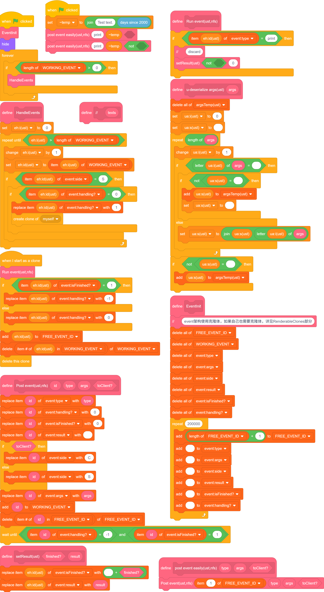
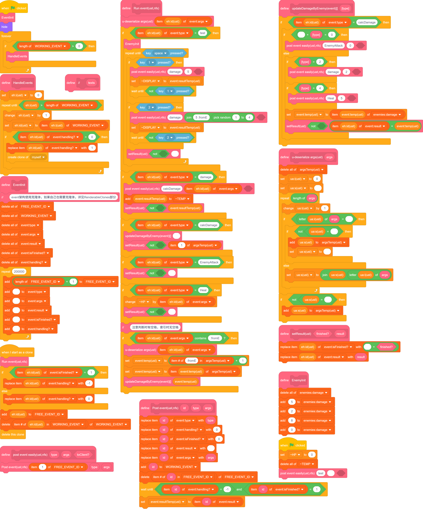

# Events

话接上文 ~~好像不是上文，反正差不多~~，我们实现了 `command` 表，能够向新线程单独传参了。  
我们的目的是创建类似“函数对象”的东西，同时能做到“二次修改”。（后面将提到它的作用。）

总之，如果你学过 `Java` 的 `Event`，那这部分应该很好理解。（大概吧。）

## 实现等待线程的终止

### command->Event

之前使用变量传递参数，这使得我们无法再获取新建克隆体信息的更新，也就阻止了我们进一步开发。  
所以我们应使用 列表。

将之前传递许多参数改为传递多个列表，一般分为 `type`、`args`，为了标注 `Event对外信息`，新建`result`、`isFinshed?`、`handling?`。

写成 `command` 太长，我不演了。直接上 `Event`。（这部分与先前没有功能上的差异，只是增减了列表并修改了名称。）

  
[^1]  
[点此测试](./test1.html)
[^1]: `//` 函数没有内容，作为注释使用，已省略

总的来说，我们确实没实现啥，接下来我们会对子弹发射进行限制并增强：子弹会面朝鼠标进行转动修正、上一发子弹撞墙后才允许下一发。  

### 等待的到来

我们已经有了 `isFinished`，只要记录它就好了，我们这里为了使参数更加稳定，进行了一次封装。

这样，我们发布Event时就不用指定id了（图左），而是按照既定方案寻址（图右）。
之后，经过简单的修改，我们实现了 `等待`。

### 追踪！

由于暂时不用URM，而且目前几乎没有交互部分，所以可以随便写。
比上一步就多了一个模块，就一块放图了。

[^2]  
甚至不到150模块。  
[点此测试](./test2.html)
[^2]: 我们目前用的是 `handling` 来等待，后面会用 `isFinished?` 辅助。

值得注意的是,目前的实现是不兼容跳帧的。  
不是因为没有URM，而是我们将克隆体用作了显示。（详见[跳帧](../Frame%20Skipping/)）

虽然不兼容跳帧可能不是很好，但你要是喜欢这种不兼容的写法，也是值得鼓励的。  
当然，你得有足够理由去这么做，而不是单纯因为喜欢写法而这么做。

## 实现返回值

Event架构本身难以实现即时更新类的功能，例如碰撞造成伤害及相关内容。但是对于有序的不限时行为，能有更好的处理。

这是什么意思呢？  
我们可以设置 `Event` 未完成，从而在下一帧重新进行一遍；  
我们可以重复设置多次返回值，仅得到最后一次；  
我们可以获取已有的返回值，得到新的返回值。

具体在[扩展](#扩展)中有更好的体现。

## 简单分类

在 `runEvent` 中，我们如果直接罗列所有 `Event`，在找具体某个的时候显然是很复杂的。

我们可以拆分到独立几个函数中，如 `BattleEvents`、`MenuEvents` 等等。

这点在后面扩展的时候更为有用并有效。

在下方分类进行展示，此处略过。

-----

## 扩展

这部分是我从使用这个架构 ~~1~~ ~~2~~ 3 年多直到现在汇总出的一些好用的内容。  
我会加上大致时间。

-----

### Event完成状态

如果你的 `Event` 忘记了实现用法，那如何发现呢？线程表的项数千千万，而错误仅在一个。

通过限定完成状态，等待完成，我们可以很好解决这一问题，这样没有实现的事件在卡住时，会阻断这一整个线程（除非你玩坏了）。

完成状态还在其他情况有用，我们可以设置不同的完成状态来更明确我们的实现目的。当然，一般是用不到这一点的，尽量使用 `result`。

具体实现统一在[多端Event](#多端event)查看。

-----

### 无返回值Event

在最原始的 `Event` 架构中，我们没有使用 `scratch` 的多线程（虽然我知道它的多线程是假的）。  
但众所周知，`scratch` 每帧执行的次数有限，往一帧里多塞一些内容总会加快它的效率的。

具体实现统一在[多端Event](#多端event)查看。

在最初我要创建多个线程时，我就添加了。大概2022年1月吧。

保证不同线程 **不冲突** 的情况下，才能这么做。

**不要用这个方法在 `Event` 里lashi**。想玩你的克隆体就自己去玩吧，别带上我的 `Event` 被踩。

嗯，攻击性有待增加。

-----

### ...

...不知道有没有漏的内容，先留一下位置。

-----

### 多端Event

和 `无返回值Event` 一起加的。

当你使用多角色，我们调用 `Event` 时为了不冲突，一般要对每个角色指定一个端名，在发送 `Event` 时指定端。

假如我们有 `S` 和 `C` 两个端，`C` 从 `S` 处获取数据后显示。

S|
--|--
C|

[点此测试](./test3.html)

-----

### 页面Event

专门作为 `Manipulator` 使用...

在最开始尝试战斗的模块完成后，我添加了这类仅 `C` 中作为 `host` 的函数。（必要时，`S` 中存在对应 `channel`，由 `页面Event` 唤起）  
大概2022年7月。（平时打游戏学习没空捏）

一般没有对应的 `Listeners`/`Triggers`，也可看作可复用的、有局部变量、每次只对一个新克隆体操作的广播模块来使用。

通常搭配 `setRender` 等封装函数，直接或间接与 `channels`、`R`、`U` 等交互，实现根据输入操作页面、跳转页面（主用于切换 `U`、`R` 的状态）。

页面之间的切换使用此法可尽可能避免未定义的页面切换，保证程序在不同页面之间不受到干扰。

具体来说，切换页面时发送有 `result` 的 `Event`，使得原 `页面Event` 的运行暂停，而新的 `页面Event` 则开始运行，执行切换页面及新页面相关指令。

具体示例见[channel](../Channels/)。

-----

### 子类标记参数

随 `Triggers` 的发展添加，大概2024年3月。

在常见参数后，可以添加不定数量的子类标记参数。（注意，这部分可能不保证合法性，可能有潜在的bug，需要更多定义去保证合法）  
举例：假定`OnDamageTo`事件的参数有3个，为`toEnemy?`、`toPos`和`amount`，只跟收到伤害方有关。  
这个事件的创建是合理的，因为伤害可以是无来源的。如果我们要关联来源，可以单加一个事件，但与 `EventTriggers` 和 `EventListeners` 等共用时会稍显冗余。  

此时，我们可以在参数后面添加 `子类标记参数`。  
假定我们将来源称作 `fromE`，对于 `OnDamageTo(true,1,5)`，我们改为 `OnDamageTo(true,1,5,fromE(false, 0))`。  
在sc中，写作`1 1 5 :fromE 0 3`，我们一般将布尔类型写作数值。

我们正常情况下不会处理后面的值，而前缀符 `:fromE` 则可以帮助我们定位参数。  
一般索引时，查找第一个 `:[identifier](空格)` 或 `(空格):[identifier](空格)` ，这可以避免一些问题。

简单示例：

[^3]
[^3]: 我们这里也使用了一个小的页面Event，但是不严格，因为没有使用URM

[点此参考](./test4.html)

-----

### EventListeners/分类器

作用：直接根据指定对象，或提取泛化后类型，执行相关功能。  
一般只在特定几个分类中存在。最初出现于约2022年3月，当我要区分招式时开发。  
有两种用途。  

一种是对已有的 `Events` 进行结果再处理（更常使用 `EventTriggers`）；  
一种是在某处特别发送一个特殊的 `Events`，其处理结果的过程仅仅为赋值一个变量、简单运算或者空。 

一般来说，这种方式的调用不与 `Event` 本身名称的含义强制相关。

我举个例子：  
`A` 攻击 `B`，发送 `OnDamageTo('B', 5, Type.ICE, fromE('A'))`，由 `AttackersEvents` 接受到 `fromE()`。  
`AttackersEvents` 找到对应于 `Global.getType('A')` 的 `Listener`，触发相关的攻击效果。  
可能会触发若干以下几种效果：  
执行正常攻击，（假设存在血量、护甲、伤害减免）计算减免后优先扣除护甲再扣除血量；  
执行破甲攻击，直接破除所有护甲并计算减免，再直接扣除血量；
攻击后释放持续冻结效果。

看起来毫无章法的运作，在掌握 `Event` 之后，便能成为你的武器，在不同的情形下都得到良好的实现，优雅地实现他人无法做到的功能。

那么，回到两种用途上。

对于第一种用途，一类是无来源的、一类是有来源的。

对于有来源的情形，一般存在一个中间函数注册于 `Event` 中，用于存储该 `Listener`（与 `Triggers` 有相近之处）。  
中间函数会拆分这些标记的状态，去除不正确（未定义）的函数，并留有位置用于注册以对应不同的 `Listener`。

对于无来源的情形，少数是直接基于原始 `Event` 的返回值、参数等进一步加工结果并执行相关内容。  
而多数情形则是从有来源的情形下拆分相对共有的功能，或一部分 `Listener` 共有的代码行，来集中处理，并提高可读性。

参考代码:  
这部分接着上次的进行了修改，对不同的 `enemy` 的伤害进行了不同内容的追加。

[点此参考](./test5.html)

-----

### Event换头以及Event归类

最初出现于 `CardWars II` 中！在2023年末构思，具体实现日期不记得了。

作用：对于已有对象，强制类型转换（无对象、其他Event或其他类型的对象）。
用途：明确不同 `Event` 的用途，同时尽可能复用之前的代码。

换头的行为有三种，一种是仅换名，一种是换名换参，一种是换实现。
前两种与原始的 `Event` 是相同的，可以认为存在一些默认值。

对于第三种，可以破除 `Listeners` 的界域限制，同时提高原有部分的可读性（减少特殊情况分类），并提供合法的参数。

一般换头是基于全局或者某一类 `Listeners`。

简单示例（3组）：

[点此参考](./test6.html)

-----

### EventTriggers/触发器

作用：将无指定对象的 `Events` 指定对象。

最初出现于约2024年1月！整个初版实现花费了数月 ~~的晚自习课间~~。在我各个由战斗的游戏中均大量存在。

看起来触发、监听是相似的行为，然而实际上无论是内部还是外部的体现上，均有巨大的差异。

我举个例子：  
`A` 攻击 `B`，发送 `OnDamageTo('B', 5, Type.ICE, fromE('A'))`，触发相关的攻击效果。  
假如正常攻击。（即无特殊扩展效果）  
此时旁边的一个实体也有特殊能力，但是与当前攻击行为完全无关，如何将这二者建立关联呢？

这就用到了 `Triggers`。

本质上，`Triggers` 的功能，是根据提前添加的 `EventSubscribe` 表，去监听这些 `Event`，然后提供相应的 `换头Event`，供我们要建立关联的`Listeners`，进而得以触发。

在我的逻辑中，固定有以下几个步骤：`Check`、`Order`、`Before`、`Trigger`、`After`。  
这可以保证逻辑的正常运行。以下进行一个解释：

对于 `Check`，采用同步的方式（同时发送所有，不在乎运行顺序）进行，之后其他的部分（只针对 `Check` 返回 `true` 的情形），都是顺序执行。  
这里发送的目标是所有或部分 `Listeners`，可由参数确定，也可由其他内容决定。

`Order` 用于排序之后 `Listener` 的运行顺序（由于是顺序执行！）。这步要尽可能确保返回的值是常量，而不是变量，因为不会提供其他 `Event` 相应的值。  
你可以选择返回多组 `Order`，按照自己所需的方式（自定义优先级）排序。

后三步是一并执行的，但是用途不同。`Before` 和 `After` 主要用于进行其他 `Trigger` 的修改，一般仅在 `Trigger`中则是执行自己的模块。（尽量不要在这一步进行其他 `Trigger`！）

注意，大部分 `Trigger` 不必先于原本可调用的 `Event`，因为我们理论上留存了足够的 `Before` 和 `After` 用于这点（不够就单独摘出来再 `Trigger`）。  
不排除少量情况语义明确时，可以进行 `Trigger`，但要注意不要过多调整运行顺序，避免出现BUG。

主要你能用这样的方式实现功能，那我们认为是合理的，但不一定是最优的（只有更优！），也不一定是优雅的。

我这里提供一个复杂的实例：

[点此参考](./test7.html)

-----

### GlobalEvents

最初出现于 `CardWars II` 后期。约2024年8月。

见 [此处](../Global%20Datas/)。

-----

...
