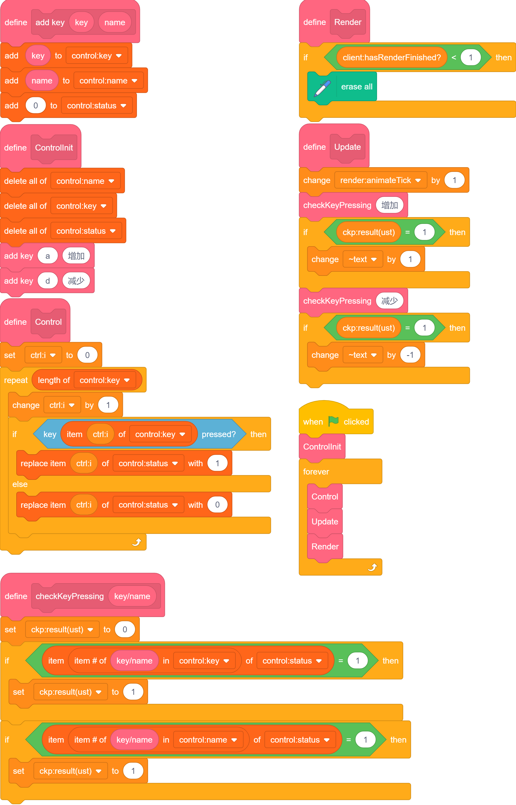
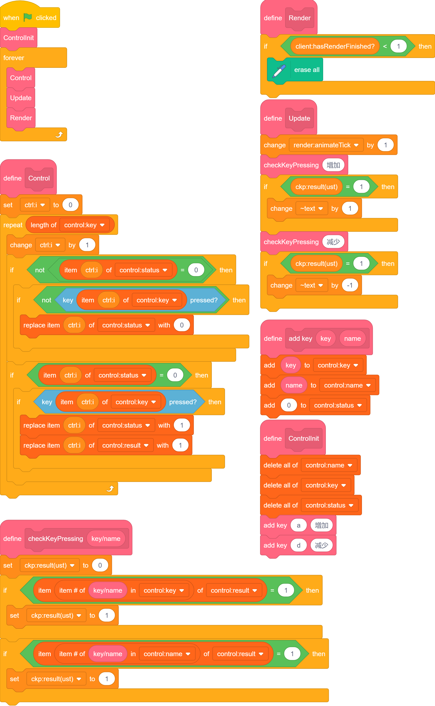
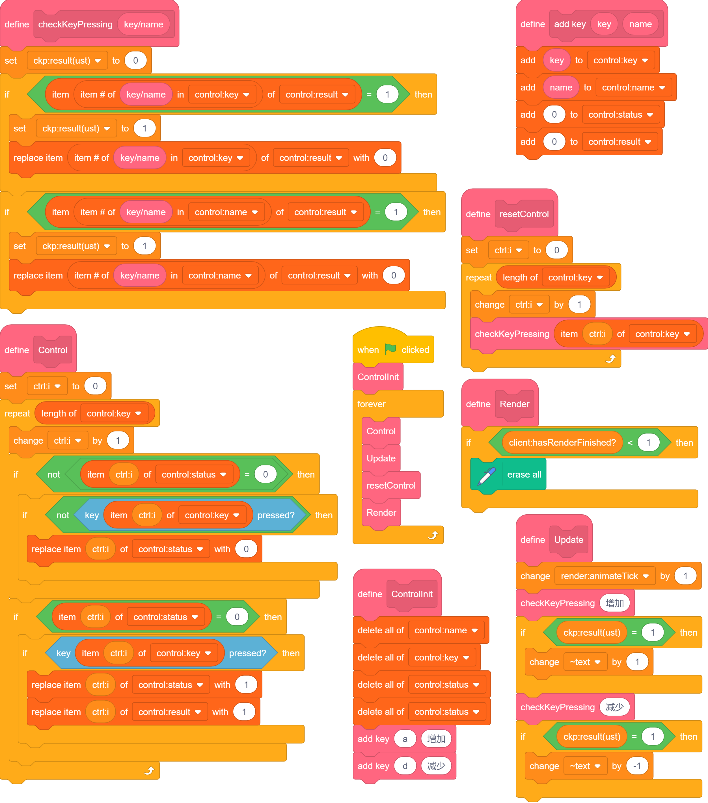
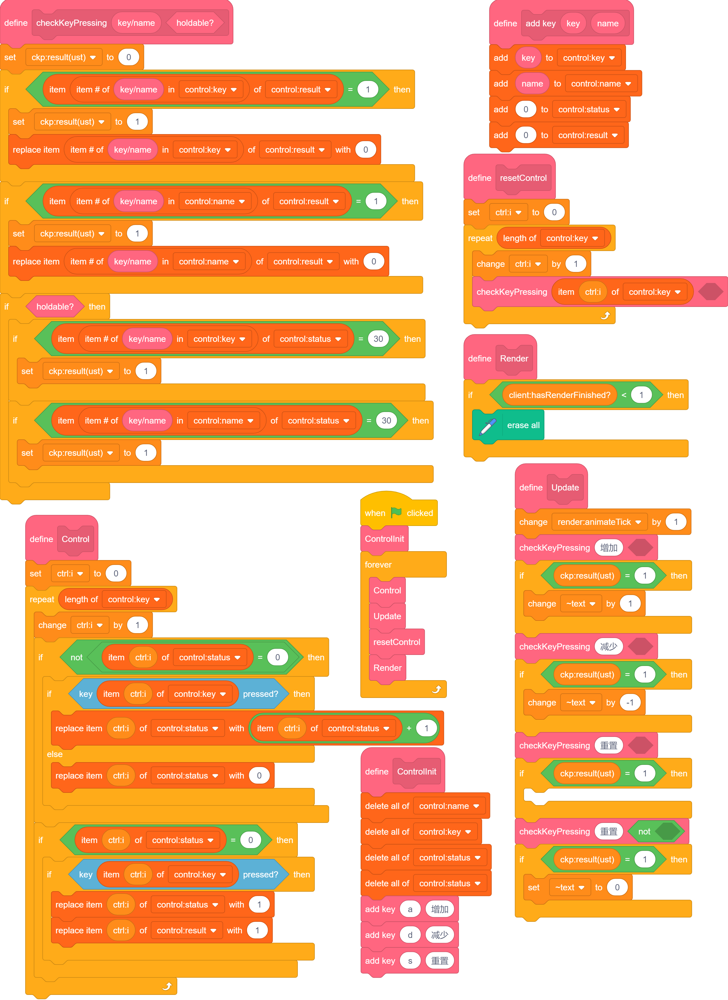
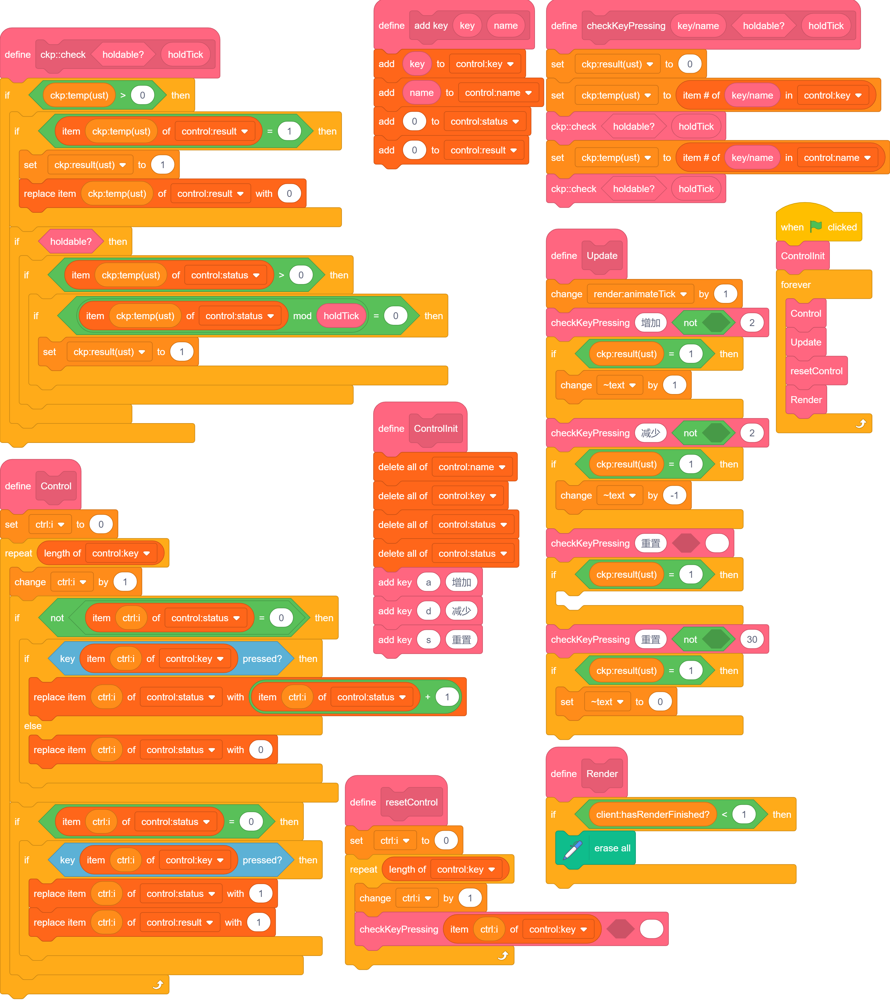
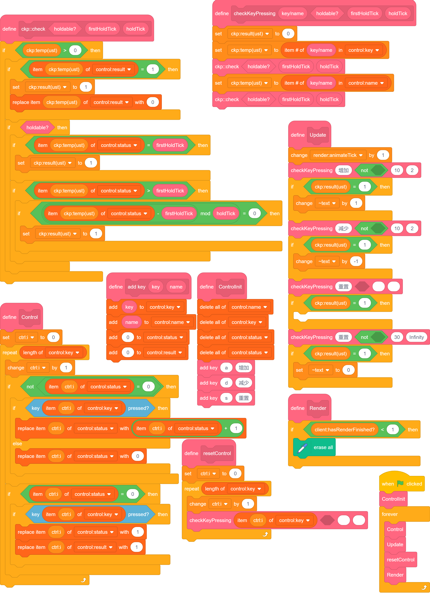

# Input Gathering

sc本身的输入功能非常鸡肋，只能检测是否按下某个键。

至少做到鼠标侦测（当角色被点击）那样吧。

需要说明的是，我们主要以[URM](../URM/index.md)作为底层。

## 键盘侦测

为了便捷地动态增减要侦测的按键，我们要用列表把它们存起来。  

### 包装按键

我们可以简单设想一下我们要实现的：检测点击、抬起和长按。  
让我们先把对于每种按键都要进行一遍的 `如果<()按下>...否则...` 化简一下。

我讲下想法，免得这步有些跳跃。

首先，用列表存储要侦测的按键种类，并将按键命名，以方便游戏中自定义按键。  
然后，在每次更新时调用按键侦测。  
侦测后，`ckp:result(ust)==1` 就等价于 `<()按下>` 了。  

具体如下：

[点此测试](./test1.html)  
由于数显的存在与否无关紧要，我们目前的渲染直接使用原生sc的变量。  

### 点击和取消点击

注意到上述仅仅一个 `status` 作为结果来处理略显不足，因我们不能让上层部分覆盖下层部分的读入。  
所以我们要新增一个列表 `result`。

此时，我们可以用 `status` 表示按键是否按下，而 `result` 可以表示是否在这一刻进行了变化以及变成了什么。

然后，我们将 `status` 根据 `0`/`1` 分开。  

为什么？  
只有在 `0` 时，检测到按下，是点击；在 `1` 时，检测到按下，是持续按下，不属于点击。

于是我们成功把 `按下` 转化为了 `点击`/`持续按下` 两种情况。  

另外，侦测的时候，要改为对 `result` 判断。  
全都改完之后是这样：  

  

此时如果你点击测试，会发现..  
根本停不下来啊！！  

对，我们忘记了清除 `result`。
所以我们要在侦测的地方把 `result` 重新赋值为 `0`。

另外，每一帧都要重置 `result`，避免“暂时没有侦测的时候，`result` 一直保留着，侦测的时候不小心侦测到了亿万年以前的点击”这样的情况发生。  
所以我新建了一个函数 `resetControl`。修改完如下：（额、为了让代码块看起来更大，稍微重新排布了一下）  

  
[点此测试](./test2.html)

### 长按

我们简单想一下就知道，长按跟点击要分开。  
不过，我们刚才实现了一部分长按，就是 `status` 为 `1` 时对应的状态。  

但是如果只是这样，长按跟最开始的情况没有区别吗？  
我认为做到“根据点击时长决定效果”会比较酷。

我们刚才写的 `not<status==0>`，也提示了这一点：我们可以让 `status` 大于 `1`，表示长按的时长。
那我们先让每 `30帧` （**正常情况下**约 `1秒`）记为标准的长按，来尝试触发一下。

那我们的更改部分还包括 `checkKeyPressing`，我们需要加一个参数来声明是长按还是点击。

具体地，我们先实现一个重置键，可以在长按一秒后将中间的数值归零。  

此时要讲一个特殊的操作：（详细见代码）  
我们要单独对单点进行处理。  
在后面访问长按时，由于 `result==0` 一定成立，不会由于单点而触发相关操作。  
（一定先单点，再长按，这部分后面会有更多的讲解）  

  
[点此测试](./test3.html)  

好了，实现了固定时长的长按，我们能否实现更多内容？比如指定长按时间？  

我们需要为 `checkKeyPressing` 增加参数，控制长按时长。  
简单观察发现，其余部分不需要进行更改。  
不过，我们把 `checkKeyPressing` 的内容进行了一些修改，节省一些模块，并增加可读性。  

  

当然，这里可以做一些奇妙操作，让操作更为顺滑。  
简单来说，我们可以单独设定第一次长按所需的时间。  

  
[点此测试](./test4.html)  

这样，我们就实现了以下几类操作：  
1. 单点，只填第一个参数即可。  
2. 条件长按，具体分类见下，与 `1` 的差别是所有参数都要填，但是判断是否可长按存在条件，如 `player.runable?==1`(`玩家可奔跑?==1`) 等。  
3. 长按后仅触发一次，最后一个参数填 `Infinity`。  
4. 长按，且长按第一次触发前需要一定延迟，此时倒数第二个要填较大值，最后一个要填较小值。  
5. 长按，且长按第一次触发前不需延迟，此时倒数两个数均填较小值即可。

## 控制时间

通过与 `跳帧` 结合，我们可以同时适配 `30帧` 与 `60帧`。

## 鼠标侦测

仿照键盘部分即可，但是判定方式略有改变。  
目前先将键盘部分内容拷贝过来并进行了少量修改。如图。

### 指定范围

### 特殊形状

### 滚轮

## 减小开销