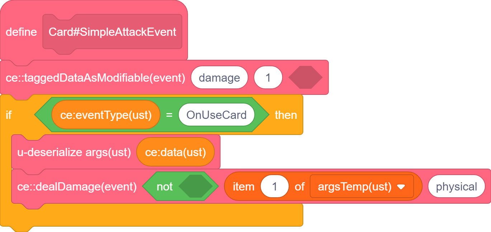
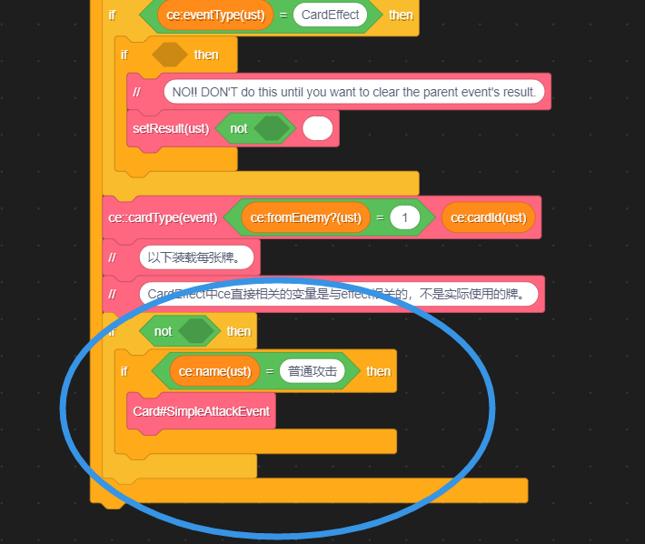
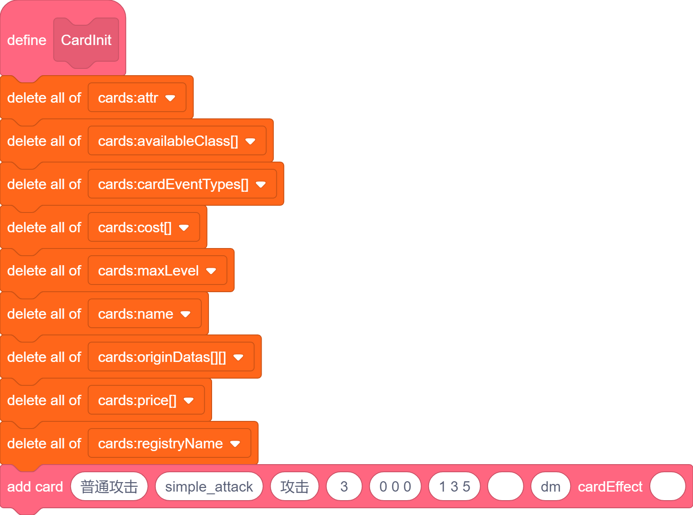
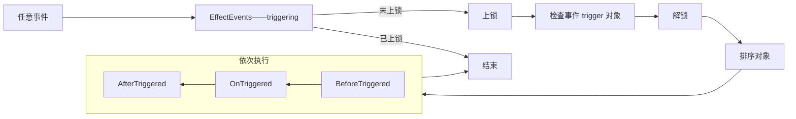
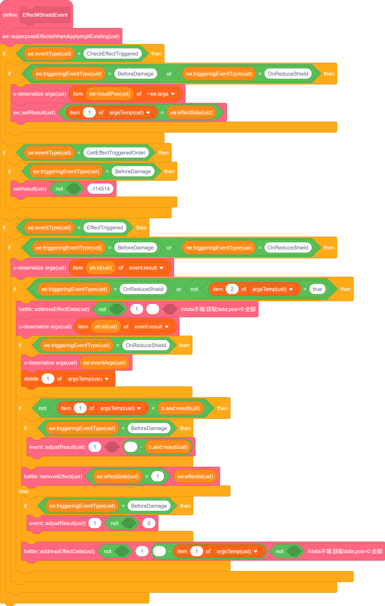
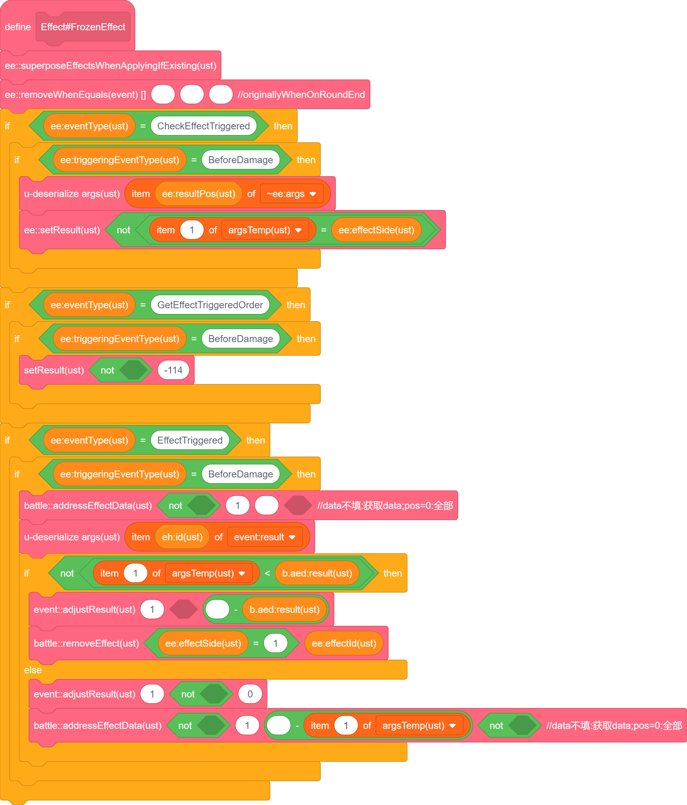
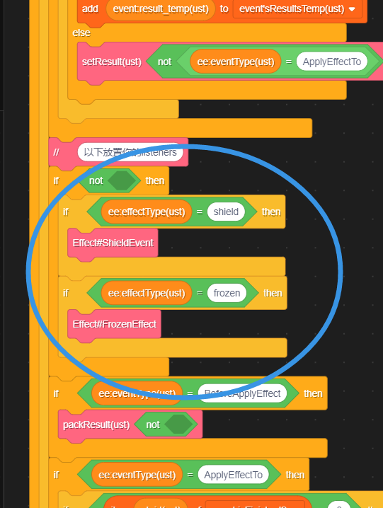
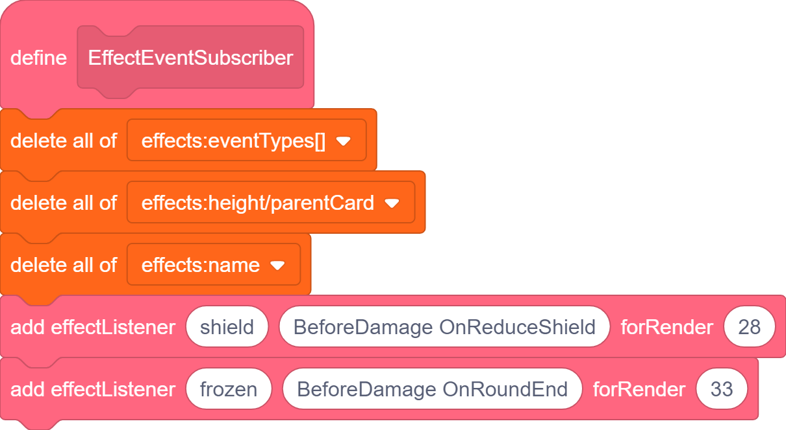
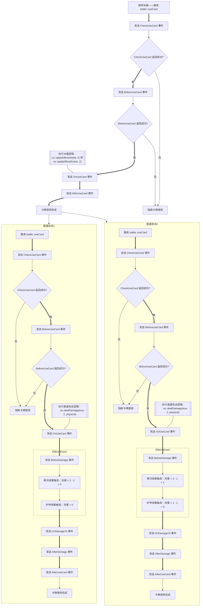
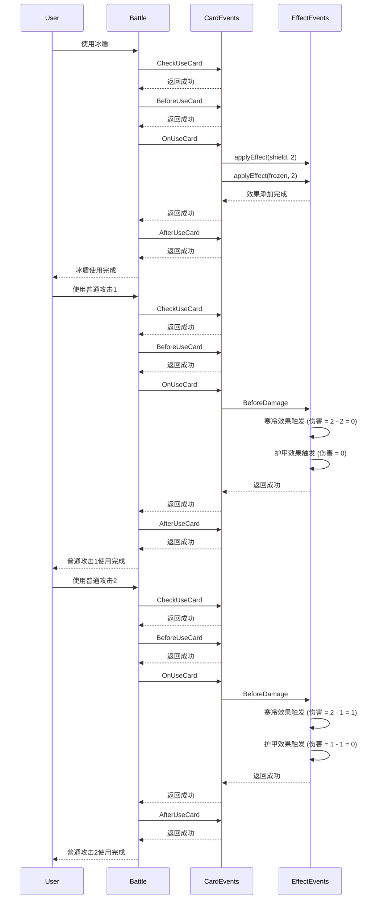

# 卡事之擎

卡牌本就是一个信息，信息的源头就是事件。  
今天我们将事件作为信息的载体，创造伟大的未来。

## 注意事项

作者是 `Chinese`，`English` 是非母语，但作者习惯使用其作为编程环境语言，所以代码例图为英文，希望不会令你感到困扰。

作者公开的引擎中包含了 `攻击` `行动` `咒术` `装备` 四类卡牌，你可以额外再行增减或修改。**发挥你的创造力**！

引擎从 `CardWars II` 修改而来，无论素材是否公开，请你尽可能 **不要使用相同素材**。

引擎主要是 **运算** 部分，作者已经验证了可以兼容克隆体进行渲染，但你 **需要做好** 他们之间的 **交互**！

如果你有什么东西没有想到解决方法，可能是引擎诞生新部分的预兆，欢迎与作者交流。

作者 **移除了** 部分可能需要的模块，包括但不限于 `存档码` 等。

总的来说，我想说的是：不要重复造轮子！~~读完这篇文章，你应该就能理解所有轮子了~~

-----

## 简介

###### _图形化只是我的谎言，学引擎节省你的时间。_

-----

我将先对一个 `卡牌被使用` 事件触发时开始梳理引擎的逻辑。  

除非相关逻辑过于繁琐，一个过程只会被详细解释一次。

仅在 `简介` 中没有提及情况下，默认认为不存在其他卡牌。

**具体内容可能需要参照其他章节，这是因为这个引擎使用到了其他章节的内容。**

-----

### 情况1
使用一张 `造成两点伤害`(记该牌为 `普通攻击`)。

分析：触发 `battle::useCard` 相关部分，先后发送至多六个事件 `CheckUseCard` `BeforeUseCard` `OnUseCard` `AfterUseCard` `CardBackDeck`，以及 `ServerUsedResult`/`SetUsedResult`(这两个先暂时忽略)。涉及到 `battle::dealDamage`。

-----

如果你想，你可以直接看后面的流程图，但文字说明会更加具体。

#### 准备工作

渲染部分略。首先在 `CardInit` 中添加你的卡牌，使用 `addCard`。  
你目前需要注意的参数只有 `name`(=`普通攻击`) `registryName`(实际用于 `效果` 部分) `maxLevel`(设置为 `1` 即可) `attribute`(=`攻击`)。

###### 卡牌与效果最不同的地方在于效果的 `name` 其实是 `registryName`，因为添加效果时其实添加的是 `eventListener`。
###### 修改这点可能会有点麻烦，附录我会写关于它的内容。

其他部分分属其他逻辑。

#### 第一步

最先发送的 `CheckUseCard` 会在 `CardEvents` 中找到 `普通攻击`，先对事件赋初值 `1` 代表执行可以成立，之后在 `普通攻击` 相关事件中 **发现没有编写该事件**，于是最终返回了 `1`，在 `battle::useCard` 中进入出牌相关逻辑。

###### _太好了，第一步就涉及了 EventListeners，真是劝退啊。_
###### _这只是最最基础的结构，希望你坚持下去，传播这个引擎。_

#### 第二步

`BeforeUseCard` 会触发，经过 `CheckUseCard` 类似的过程，返回了相同的返回值，在 `battle::useCard` 中触发了相似的逻辑。(我知道很抽象！)

#### 第三步

`OnUseCard` ~~终于~~ 触发了，在 `CardEvents` 中找到了你编写的 `普通攻击` 逻辑，执行 `ce::dealDamage(true, 2, physical)`，代码如下:

  
  


另外需要指出：`Card#SimpleAttackEvent` 在 `CardEvents` 中进行了 **注册**。

部分参数不需要在意，之后会详细解释。

###### _规范命名可以帮助你维持一个逻辑的严谨性，我不强求你完全使用我的规范，但至少在一部分代码遵从。具体见附录！_

#### 第四...等等，损伤

我们忘记了 `dealDamage`！！！  
卡牌游戏中最终极的目标的就是决定双方的胜负，而血量判定是最简单的一种。

在 `BattleUtil` 中，我放置了很多战斗相关的内容，包括 `HPEvents`。你可以简单的把杂项放在这里，或者自己新建一个作用域。

仔细观察 `battle::dealDamage`，我们发现主要分为四步：保存 `preFix`，发布 `BeforeDamage`、`OnDamageTo`、`AfterDamage`。  

我对它们的界定如下：  
`BeforeDamage` 用于修改伤害值。  
`OnDamageTo` 用于实际执行伤害以及直接附加效果(后者一般放在 `AfterDamage`，大部分 `After` 会在之后提及)。
`AfterDamage` 用于攻击后附加效果。

注意：有很多相似的事件都和它一致，多多阅读源码以成为大师！

#### 第四步(这次是真的)

`AfterUseCard` 触发，与 `BeforeUseCard` 类似。

-----

#### 杂项

我将解释 `CheckUseCard` 和 `BeforeUseCard` 的区别、`ce` 和 `battle` 的区别。  
他们作为引擎的逻辑，经过我说明，并不意味着引擎不能随意更改——只有适合你想做的事的引擎才是最棒的！

###### _学习的目的是应用，不是考试。_

-----

#### 相似而不同

当以下 `Event` 返回失败时：

| 事件名称         | 返回失败时的行为                                                                 | 是否阻断卡牌使用 | 是否触发卡牌相关逻辑 | 是否消耗卡牌及费用 | 是否记录卡牌使用 | 特殊说明                                   |
|------------------|----------------------------------------------------------------------------------|------------------|----------------------|--------------------|------------------|--------------------------------------------|
| `CheckUseCard`   | 在事件的发送后阻断[^1] | 是               | 否                   | 否                 | 否               | 正常使用手牌以此法失败时，会回到手中       |
| `BeforeUseCard`  | 直接阻断卡牌使用                                                                 | 是               | 否                   | 是                 | 是               | 无                                          |

[^1]: `ServerUsedResult`（其他使用）/`SetUsedResult`（正常使用）。

看起来 `CheckUseCard` 可以检查费用不足时使用消耗费用的牌，那 `BeforeUseCard` 还有什么用呢？  
留给你的思考...

-----

#### 作用域

`battle` 的作用域是整场战斗，只要是战斗中，就是合法行为。当然，多线程触发各种事件仍然是未定义行为，一定要确保你的"事件 **流**"唯一。 
`ce` 的作用域是 `CardEvents`，它需要 `CardEvents` 开头初始化的那些数据——他们提取了一个卡牌的信息，修改引擎时也要注意添加你自己新建的信息。  

这个差异的目的是便捷的使用，如果只调用 `battle::dealDamage`，你可以自行尝试不破坏作用域的情况下以最少代码实现相同的逻辑，以此自行感受代码复杂程度。

-----

#### 小结1

我们提及了 `EventListeners` 的使用与 **注册**，讲述了简单的三段结构(`Before` `On` `After`)和作用域的含义。

<div style="display: flex; justify-content: space-between;">
    <div style="width: 48%;">
        <h3>普通攻击运作流程</h3>
        ```mermaid
        flowchart TD
            A["触发 battle::useCard"] ==> B["发送 CheckUseCard 事件"]
            B --> C{"CheckUseCard 返回成功?"}
            C ==>|"是"| D["发送 BeforeUseCard 事件"]
            C -->|"否"| Z["阻断卡牌使用"]
            D --> E{"BeforeUseCard 返回成功?"}
            G --- F
            E ~~~ G[["执行普通攻击逻辑：
            ce::dealDamage"]]
            E ==>|"是"| F["发送 OnUseCard 事件"]
            E -->|"否"| Z
            F ==> H["发送 AfterUseCard 事件"]
            H ==> J["卡牌使用完成"]
            H ~~~ Z
            J & Z --> T(("结束"))
        ```
    </div>
    <div style="width: 48%;">
        <h3>dealDamage 相关流程</h3>
        ```mermaid
        graph TD
            A["触发 battle::dealDamage"] ==> B["保存 preFix"]
            B ==> C["发送 BeforeDamage 事件"]
            B ~~~ D[["修改伤害值"]]
            F --- E
            C ==> E["发送 OnDamageTo 事件"]
            C ~~~ F[["实际执行伤害"]]
            D --- C
            F ~~~ H[["附加攻击后效果"]]
            E ==> G["发送 AfterDamage 事件"]
            G --> T(("结束"))
            G --- H
        ```
    </div>
</div>

一个普通的攻击，引出了这样复杂(吗?)的逻辑，你可能会觉得没必要，那请听接下来的内容。

-----

### 情况2
使用一张 `获得两点护甲，给予对手三点寒冷`(记该牌为 `冰盾`)。对方再使用两张 `普通攻击`。

分析：类似情况1。还涉及到 `护甲`、`寒冷` 两个 `效果`。

-----

使用卡牌过程略，将详细分析 `OnUseCard` 过程，以及 `效果` 对 `普通攻击` 的影响。

#### 效果的添加

在 `冰盾` 正确注册的 `OnUseCard` 中，调用 `ce::applyEffect(shield, 2)` `ce::applyEffect(frozen, 2)`。

就完事了。这里存在一个 **解耦** 的逻辑：每次添加时直接发送添加的事件，让各个 `效果` 单独 **注册** 事件的执行。

###### _运者，尝有大藕当中流，不行也久。一员解耦而下，运者通，百年有余。记其事为解耦。云云。_

-----

为了方便，我们将 `效果` 称作 `Effect` 吧。(其实是先有 `Effect` 才有的这篇文章，但谁在乎呢?)

##### Effect 的添加

如之前所说，`effect` 是作为 `effectListener` 存储的，所以你要注意其 `name` 在传参中的拼写，防止意外错误发生。
这里建议在 `EffectEvents` 中发现拼写错误时抛出异常以提醒你。具体见附录。

对于 `add effectListener`，第三个参数用于渲染，跟高度有关，你可以自行尝试。  
第一个参数用于指定 `effect`，第二个参数用于添加你要触发的事件(触发不是监听！)。

##### Effect 的机制

###### _触发不是监听_

在 `CardEvents` `EffectEvents` 开头有一串相似的内容，它们负责监听的分发功能，也是监听的核心。

该部分流程较为繁琐，提供流程图如下：



具体的解释参见 `EventTriggers` 章节。

这里有几点特别需要注意，此处将额外稍加提及：

只要你添加了某一事件的监听，你就 **必须** 至少对 `CheckEffectTriggered` 进行监听(建议对不同事件单独监听)，并使用 `ee::setResult` 来设定是否需要触发其他逻辑(包括 `GetOrder` `Before` `On` `After` 等)。

仅在 `CheckEffectTriggered` 过程上锁是为了避免 `CheckEffectTriggered` 被 `Trigger` 导致无限循环及未定义行为(`Check` 过程可能涉及多线程)。

你可以对除了 `CheckEffectTriggered` 的其他提及的 `Event` 进行 `Trigger`。

-----

#### Effect 的触发

###### _到了我最喜欢的 EventTriggers，逻辑更上一层楼！_

-----

##### 第一个普通攻击使用时

直到 `OnUseCard` 都与之前一致。

执行 `BeforeDamage` 时，护甲和寒冷就 ~~发力了~~ 生效了。先提供代码以具体说明：

  
  
  


-----

先执行 `CheckEffectTriggered`，分别在护甲和寒冷处赋值为 `1`。

之后在 `GetEffectTriggeredOrder` 处，设定护甲小于寒冷。(注意：`Order` 越大越靠前执行)

寒冷先执行 `EffectTriggered`，发现寒冷值大于伤害，结果扣除相应寒冷值并将伤害赋值为 `0`。  
护甲再执行 `EffectTriggered`，发现伤害为 `0`(不足护甲值)，结果扣除 `0` 点护甲并保持伤害为 `0`。

-----

`BeforeDamage` 执行完毕，伤害为 `0`，进入 `OnDamageTo`。(特别的，根据实现，可设计成伤害为 `0` 时仅渲染伤害，不触发 `On` `After`)。

需要指出：目前没有涉及到 `Before` 和 `After`，其作用以文字说明分别是：  
+ "当...时，该 `Effect` 失效"  
+ "在该 `Effect` 触发后，...触发"  

这大概能说明它们的作用，以后可能给出相关案例。

-----

##### 第二个普通攻击使用时

基本同上，不同之处在于：

寒冷先执行 `EffectTriggered`，发现寒冷值小于伤害，结果扣除全部寒冷值并减少等量伤害。  
护甲再执行 `EffectTriggered`，发现护甲值大于伤害，结果扣除相应护甲值并将伤害赋值为 `0`。

-----

二者总结如下：

1. **流程一致**：  
    - 两次攻击都遵循相同的流程：... → `CheckUseCard` → `BeforeUseCard` → `OnUseCard` → `BeforeDamage` → `OnDamageTo` → `AfterDamage` → `AfterUseCard` → ...
    - 在 `BeforeDamage` 中，护甲和寒冷效果都会生效。

2. **效果触发顺序**：  
    - 护甲和寒冷的触发顺序由 `GetEffectTriggeredOrder` 决定，寒冷先于护甲执行。

3. **伤害计算逻辑**：  
    - 在 `BeforeDamage` 中，伤害值会根据护甲和寒冷的效果进行调整。
    - 如果伤害值被调整为 `0`，则可能不会触发 `OnDamageTo` 和 `AfterDamage`（根据具体实现）。

4. **不同点**

| 对比项         | 第一次攻击                                | 第二次攻击                          |
|----------------|------------------------------------------|-------------------------------------|
| **流程**       | 相同                                      | 相同                                |
| **寒冷效果**   | 寒冷值 > 伤害值，扣除寒冷值并将伤害值设为 `0`| 寒冷值 < 伤害值，扣除寒冷值并减少伤害|
| **护甲效果**   | 伤害值已为 `0`，护甲值未扣除                | 护甲值 > 剩余伤害值，伤害值设为 `0`  |
| **最终结果**   | 伤害值为 `0`，目标不受伤害                  | 伤害值为 `0`，目标不受伤害           |

-----

#### 小结2

更深入的机制接触到 `Effect` 和更为全面的三段结构，同时新增的 `EventTriggers` 使得事件的修改变得灵活。

整体流程如下(已忽略 `MoveCard` 等)：  

实际运作流程如下：


丰富的机制使得简单的攻击变得更加复杂，而这之中不变的是我们简单的引擎。

-----

### 情况3
装备一个 `每使用两张攻击牌，造成一点伤害`(记为 `短剑`)

-----

## 核心代码分析

-----

## 渲染部分

-----

## 其他代码分析

有些内容上述未涉及，进行补充说明。

-----


-----

## 附录

###### 对于一些人来说，这里才是正文。

-----

### 其他代码规范

-----

### 将 Effect 作为非事件添加

-----

### 检查错误，抛出异常

-----

