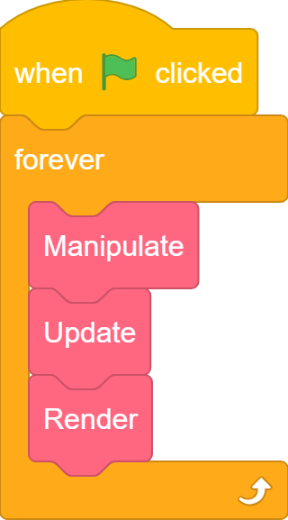
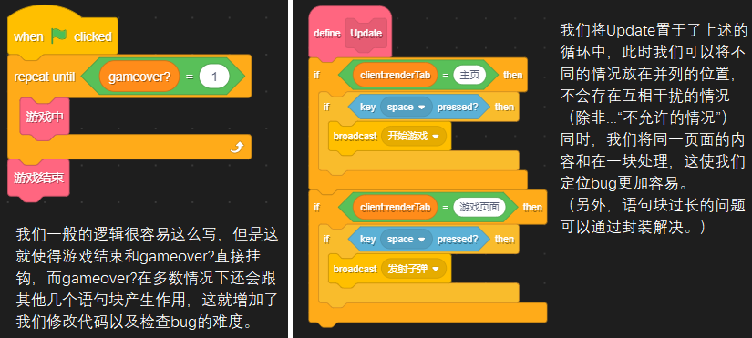
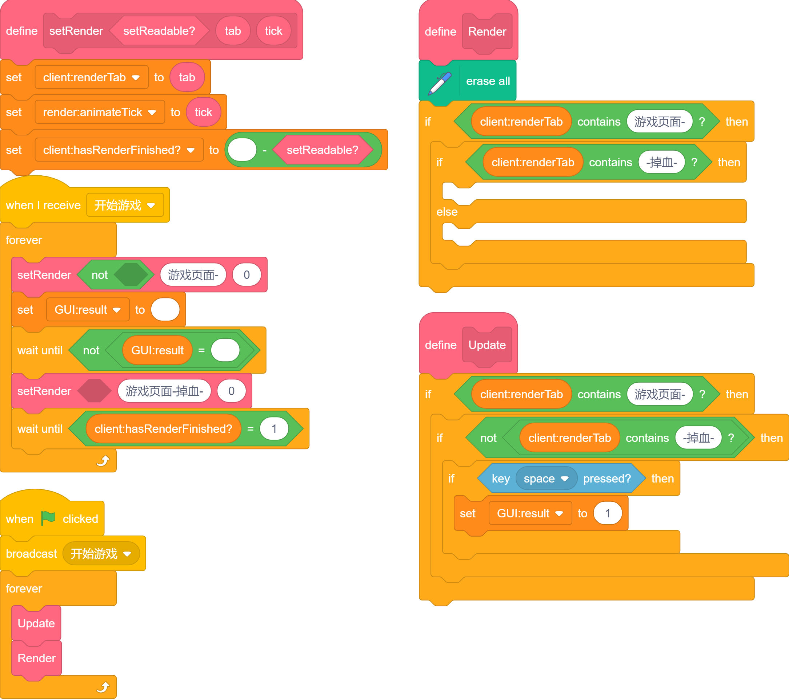
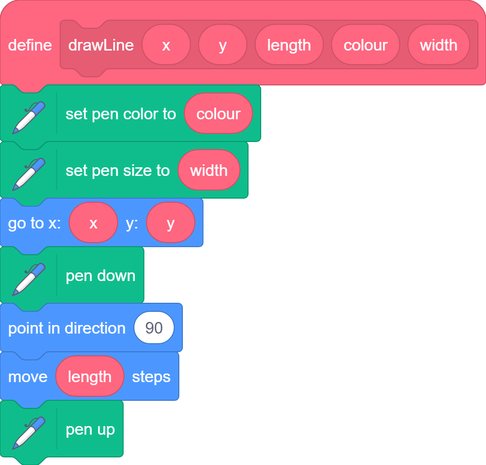
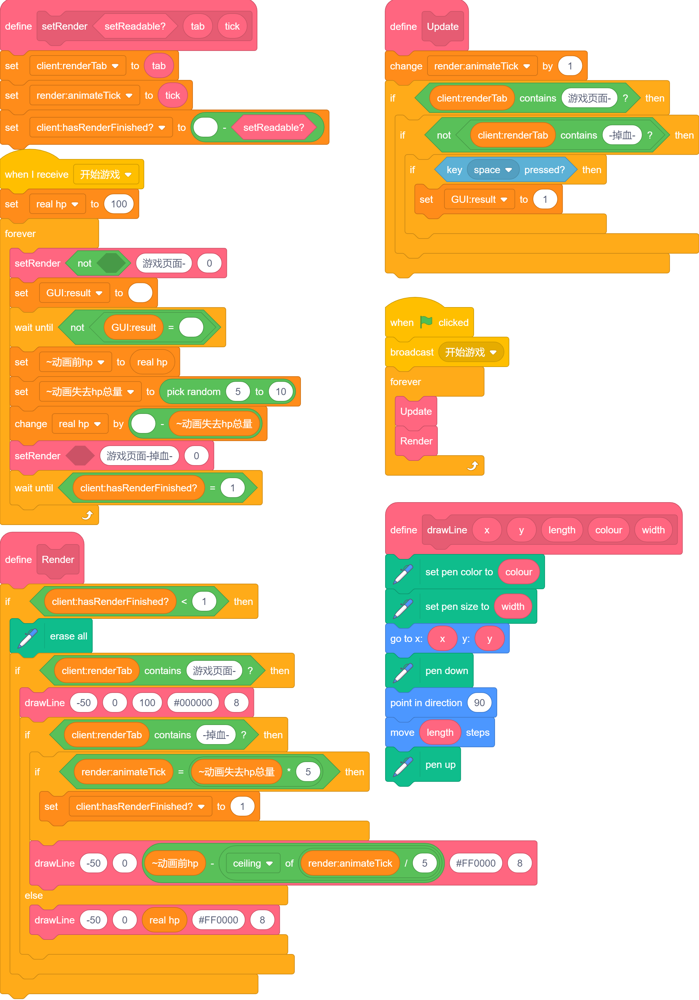
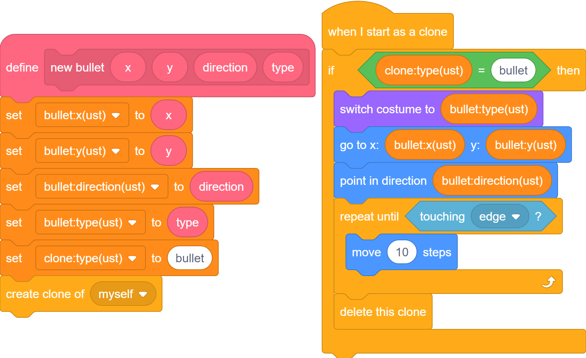
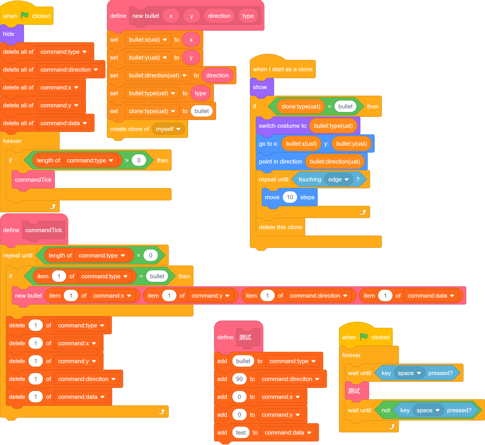

# URM

*updates renders manipulates*

-----

## 引入

-----

简单来说，URM就是 ~~UnknownResourceMachine~~ 更新`Update`、渲染`Render` 和 控制`Manipulator`    
（下称`U`/`R`/`M`）  
正常来说把三个部分放到一个循环里即可。  

{ width="100" align="left" } 三个函数里放置分别的函数，这个在[格式部分]()讲述。  
~~格式部分不知道在哪放，于是一直没写。~~

不过，一般使用时，我们并不显式的使用 控制，而是将其拆分为操作部分和非操作部分（对应检测键鼠输入）。  
检测部分详见[操作封装](../Input%20Gathering/index.md)。  

非操作部分一般使用单独的循环或广播，这将在下方提及。

-----

## 更新部分 Updates

-----

这部分主要负责的是内容更新，例如游戏帧更新、AI运行、根据操作部分获取的输入执行相关内容...等。  
虽然说目前没必要将`Updates`和`Renderers`分得太死，但是你将会知道它的用处。  

既然我首先提及的架构是这个，那它一定有一定的优势（以免无聊到使人看不下去）。  
#### 我们将隆重引入...  
  ~~client:renderTab~~ 换个你更能看懂的：`当前渲染页面`  
我来举个例子说明她（对，她。）的伟大。（这里使用最原始的写法，一会我们会对其进行拓展。）  

  
[^1]
[^1]: 我知道黑色背景显得不是很适合，但我实在懒得把里面的字拿出来了  

很好！我们现在利用这位至高无上的变量取得了没有任何成果（我是说目前）。
因为一个非常小的问题就能难住它：如果是游戏页面，如何简便地区分关卡？如何简便地实现“物品栏”等上层半覆盖页面？

#### 经过大量尝试与比较，我最终得出的结论是：  
  - 对于同源而不同的页面，我们采用二级字符串；  
  - 对于同页面的复杂信息，我们采用全局变量。  
举例：战斗页面实现掉血，为了测试掉血的有效性，我们采用键盘触发的方式执行掉血的功能。`掉血需要有动画。`

  

如你所见，我们没有写渲染部分，但是 ~~我知道你们一定自己会写~~ 我们会放在下一部分提及他们。  

包含语句和特殊命名过的 `client:renderTab` 对应上述的二级字符串。简单来说：第一串字母和第一个`-`（随便你用什么，我喜欢用短横线）标识了第一级字符串；后序的每串字母由`-`隔开，分别作为第二级（不分前后）。

二级字符串判断时需要判断包含 `<-name->`，即两侧均需要输入短横线，name是你设置的状态。  
这同时意味着我们需要复杂化第一级字符串避免出现 `adGui` 和 `breadGui` 这样后者包含前者的情况，但我相信利大于弊。

需要指出的是，我们声明了 `client:hasRenderFinished?` 用于标识当前的状态（主要提供给M）；而 `GUI:result` 用于向 M 提供状态。（由于 `U` 一定存在于本体，而 `M` 不一定，我们必须使用全局变量表示他们）  

~~`render:animateTick`是什么？你把他忘了！~~  
~~好吧，下个章节再说~~

#### 明确Updates和Manipulates基本的交互
  `U`负责与控制模块交互，并将状态信息返回`M`  
  `M`以其 与"`U`,`R`循环"隔开 的特性（如之前所说），可以使用等待模块等[U无法使用的模块]()  

等我们明确Renders的作用后，我们会再来提及Updates。  
~~相信在看了这么多，你一定有所收获。~~  
~~不，我说真的。~~

-----

## 渲染部分 Renders

-----

渲染部分我们一般使用图章及画笔，图章为主。  
或者你可以使用克隆池，这里不多赘述。不过，[多彩造型](../Colorful%20Costumes/index.md)还是值得一试的。

#### 其他话就不多说了，让我们`直接`开始吧。

接着Updates部分，为了方便显示血条，我们封装一个函数：  
{ width="300" }

然后就很好写出Render部分的代码了：  

[点此测试](./test1.html)

接下来我们会对该部分代码进行详细的剖析，虽然它非常的简单。~~毕竟用这架构两年了~~  

### 我是剖析
~~呃。是又如何？不是又如何？~~

#### drawLine
没什么可说的，随便封装了下。

#### setRender
切换状态最常用的函数之一。经常存在不同的写法，这种是最全的一种。  
可以选择设置一些默认状态，详见我的[函数命名规则](../Basical%20Naming%20Rules/index.md)。  

不过，如果需要页面间的切换动画，我们还有另一种写法，这需要 `blackscreen`:[点我](../Black%20Screens/index.md)，我一般将其称为`setRenderTab`。但一般使用的还是`setRender`。

#### Update
添加了帧动画的更新tick。  
~~render:animateTick：“你总算想起我了！”~~  

#### 开始游戏
添加了切换动画前的准备工作：设置两个`~`开头的变量，其意义详见[命名规则](../Basical%20Naming%20Rules/index.md)。  

~~呃，过了这篇就不再管命名规则什么的了吧，看不懂又不是我的事。~~  

由于sc的特性，这些模块会在同一帧（姑且这么叫吧，会有不同的）执行，所以不会出现预料之外的动画，除非你用了特定模块。（详见[跳帧](../Frame%20Skipping/index.md)）。

~~好吧，我承认我的讲述引用了后序的部分，不过这不重要！...但愿吧。~~  

值得注意的是，我的代码偶尔会混杂`空格`和`空白`，这是必要的，但我一定会去作说明。
GUI:result的值在监听状态下`一定为空`，一般得到的值`非空`。  

总之，得到GUI:result的值后，它会随机造成伤害并开启动画。  

#### Render
到了我们的重头戏。(头轻脚重是合理的)  
添加的这个选择语句用于避免帧间删除画面，而`setRender`中设定的值均满足条件，那很容易就有疑惑：究竟 `setReadable?` 是干什么的？  
呃，很简单，~~你不用知道。~~ 这在[操作封装](../Input%20Gathering/index.md)中有所说明。

好了，接下来我们看中间的部分，我们在 游戏页面 讨论了两种情况，而有`~`的变量的作用于仅在其应在的页面中。  
我们很容易就能注意到：每个页面的错误，仅仅会在那个页面找到（废话！）。  
嗯...我想说的是，我们可以快速锁定报错位置及原因。（搭配Turbowarp搜索功能食用更佳！）

#### 绿旗
应该没有人不知道绿旗吧？  
~~这条的意义究竟是什么...~~

### 总结
URM的大致架构 ~~不是XRJ大神的作品，XRJ先生请不要生气~~ 就是这样了，我接下来会补充一些 ~~没什么必要~~ 拓展的内容。

-----

## 广播的new usages和Events的引入

-----

### 广播是广播，事件是事件。

你会发现我上面的代码使用的`M`是广播实现的，而不是循环，它的优势很多，当然也存在劣势。  

优势其一如上所说，能运行持续多帧的运算等。  
其二对我来说没什么用，但喜欢克隆体的可能会比较喜欢（都用`URM`了用什么克隆体！？ ~~一会就打自己脸~~ ）。  
其三...好像没了。

不过广播架构起源甚早，作为最容易的开线程方式，长时间为人所使用。如果使用不当，也会bug连连。  

### 广播的劣势

#### 你说得对，但是我一般不用广播。  

广播劣势有三：  
1. 不能传参及获取返回值。  
2. 不能多线程同对象（对象=角色/克隆体）调用同一广播。  
3. 不便指定运行先后顺序，详见[跳帧](../Frame%20Skipping/index.md)

为了解决第一项，我们可以指定列表、变量，但这显然不好写。~~其实是我不会~~  
第二项和第三项是广播的固有矛盾，我们解决不了。  

于是我开发了用克隆体代替广播的方案，而后序的进一步对其的探索和开发告诉我，这是对的 ~~虽然容易炸克隆体上限。~~  

### 前身之 子弹封装

众所周知，射击游戏很好做，在迷宫游戏或者跑酷游戏上套壳即可。  
其中用到的一个关键部分类似这样：  
  

众所周知，`ust`是`unstatic`，意味着"私有"。无论私有还是公共，变量会传递给克隆出的克隆体，那么我们可以仿照她（对，她）构思我们需要的方案。

于是就产生了：

### 前身之 command列表

本质上是子弹封装的实际运行。

[点此测试](./test2.html)

此时，我们完成了“广播”的发送。要做到事件，我们还需要进一步开发，详见[事件](../Event%20Attached/index.md)

## 结语
这个引擎不需要任何sc底层知识，老少咸宜，如果你看完一遍没有看懂，~~还是去老老实实学文化课吧~~ 其实不算奇怪，毕竟我写的就挺莫名其妙的。最关键的是要去实践。

## 拓展
虽然写了结语，但果然还是很多东西没有说完啊。~~那你写结语干什么啊！就当是分段总结了吧。~~  
以下内容会与其他章节相关联，建议先行阅读其他章节。  

### URM实现动画
URM能实现可交互页面我们已经清楚了，但动画才是更为强大的一点。  
你可以自定义你想要的动画，只要你能拟合它的曲线。  
我们会举一个简单的例子作为参考：  
1. 让`A`在笛卡尔坐标系的整点之间移动（仅上下左右四个方向），`A`移动过程中需要有动画。  
2. 出场时`A`需要有动画。
3. 按下空格时`A`死亡，播放动画并显示菜单。
4. 菜单页面可选择重新开始或结束。
5. 菜单和游戏之间切换时需要动画。

乍看需要大量的动画，~~直接非线性就好啦！~~ 不过没有关系，我会逐个拆解。

#### 出场动画和退场动画
由于在这个例子中，`A`只存在一个，我们可以认为`A`出场、`A`退场、`A`处在其他状况为三个子页面。  
然后就简单的构思好了相关的代码。（动画比较逆天，看不懂无所谓）  
这个代码应该还是比较简单的，但是我们可以封装一个`draw`函数：  

这样就可以一下写完两处的代码了：  

我们暂时不需要管能否访问到这里，不过正常来说应该也会做吧。

#### 游戏和菜单
这里只是简单处理一下笛卡尔坐标系和菜单，并处理输入。（需要[操作封装](../Input%20Gathering/index.md)）

...（未写完）

#### 移动
移动部分很好写，但是这里的动画与前面不同，不但需要`A`的当前坐标，还需要移动后的坐标。  
事实上，我们不妨记录移动前坐标，将移动后坐标存入`A`的当前坐标即可。  
**注意！！** 我们这么做的同时需要切换子页面，以免出现`A`瞬移到下一格后开始动画（此时还会瞬移一次）。  
如果你需要跨帧遍历事物，你需要`client:hasRenderFinished?`设为1。

总之，代码大概这样写：  

呃。然后就没什么了。

#### 页面切换
随便写一个。  

...（未写完）

#### 最终结果
[点击测试]()  
...（未写完）